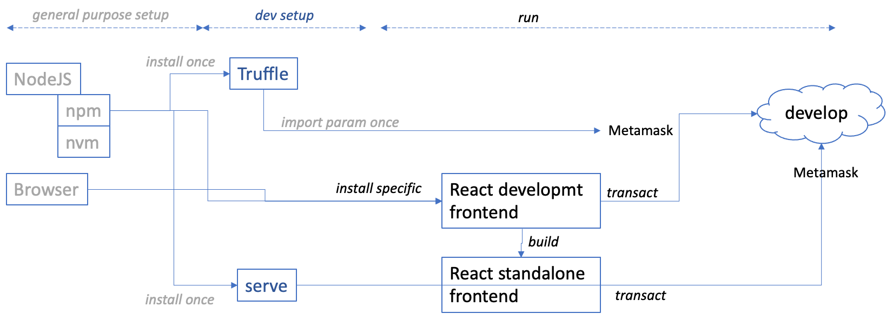

# General Purpose Setup - Getting Started with Truffle and React

## Introduction

The setup process described in the main [README](./README.md) goes through 3 stages. The first 2 are described mainly for the sake of completude but can usually be skipped.
1. general purpose setup;
2. development setup;
3. specific setup and run: this part is specific to the demo.



  
This description below covers the general purpose setup.

_Feel free to skip this section if you have already this environment._
## Coding tools
Starting from scratch, you need to install `nodeJS`, then use the node package manager `npm` to install `truffle`.
* To install nodeJS on Ubuntu 20LTS, follow [these YouTube instructions](https://www.youtube.com/watch?v=OMhMnj7SBRQ)
* To install nodeJS on MacOS, follow [these instructions](https://dyclassroom.com/howto-mac/how-to-install-nodejs-and-npm-on-mac-using-homebrew)

## Browser with Metamask extension
Then you need to install a browser that is compatible with Metamask, like Chrome or Firefox. Chrome has better debugging tools.
* If you use MacOS, Chrome is available from [here](https://support.google.com/chrome/answer/95346?)
* If you use Ubuntu, download and install as below
``` bash
    $ wget https://dl.google.com/linux/direct/google-chrome-stable_current_amd64.deb
    $ sudo apt install ./google-chrome-stable_current_amd64.deb
```
Finally, install Metamask extension for your browser and, later below, connect to the `truffle develop` local blockchain network and import the first account of the 10 accounts that are generated.
  * [video guide to install Metamask](https://youtu.be/WAStJtjYI_c) 
  * MetaMask connection to `develop` blockchain: select menu "Networks", choose "Custom RPC", set network parameters, click "Save" 
  * import first account of `develop` blockchain: click on icon "Account", choose "Import Account", paste account private key copied from `truffle develop`, click "Import" 

