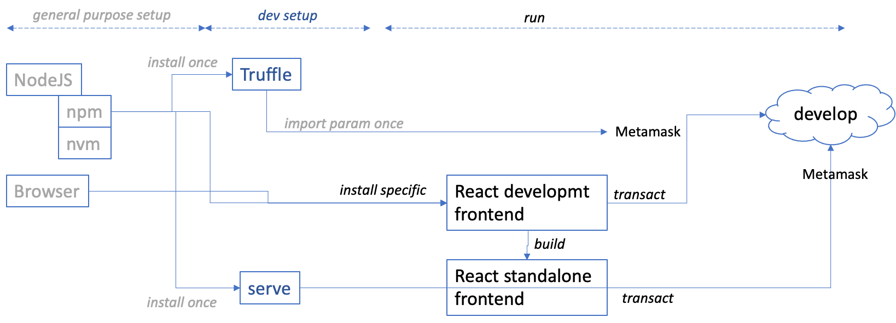

# Development setup - Getting Started with Truffle and React

## Introduction

The setup process described in the main [README](./README.md) goes through 3 stages. The first 2 are described here mainly for the sake of completude but can usually be skipped.
1. [general purpose setup](./README-1.md): this can be skipped if the reader already installed it for other needs;
2. development setup: this setup is specific to blockchain development, and may also exist already;
3. [specific setup and run](./README.md): this part is specific to the demo.



This description below covers the development environment setup.

_Feel free to skip this section if you have already this development environment._

## Install truffle
Once `npm` is installed, use it to install `truffle`
```shell
    npm install -g truffle
```
Run the local `develop` blockchain
``` shell
$ truffle develop
    ...
    Truffle Develop started at http://127.0.0.1:9545/

    Accounts:
    (0) 0x4d79c0d414e7e70b6323904d3a9085b86d8f82ff
    (1) 0xaebfe6f06361842eacd140646374e8d0110b0cc1
    (2) 0x49b56ee1f07a6fc72d808ed905f16a4c94869bbc
    (3) 0x71f165ead2cfca9221b53a6f5daae21682bd1055
    (4) 0x9b7a12cc33f8700f04f012836a3b6ba9583c2416
    (5) 0xcd81fd73490bba8b7030d9489e4475bcfe24e638
    (6) 0xbaf0bb7bc5cb3f542c7c46b7df9c26d894ce93e7
    (7) 0x2897aa7685e510a83a247927d780183a0dc2ad92
    (8) 0xa207ab0d24a16c604dc456f0e3974988c56c87d2
    (9) 0x129d24f41c27689ce13c2af546fc842f6ba30c81

    Private Keys:
    (0) 33f9646f72ff23f963d69889d45039602da387600fa7da4b41056890dd623f53
    (1) 54cf9b9e9caf2d328fab05a545d33403a992bea38ce1d2fd7277ce0b587ed7d3
    (2) 60ab4a3965b10a47a5880fafb1da7cd98153b297a8f69bc92bcdffb38272976e
    (3) b44ea1b784c84107237679782eabedce0565d028a075ec76552f8d04e080d79d
    (4) 34f2579734e55eade04420976e143fa2c814dfc8fcd4fc42263f19e95f4200cc
    (5) 1e139532c9e0eb2b441417f2f12501f52e55be6f127a6599e298e69138af009a
    (6) 31d4b5c4b095af854699aaa4eff1e3162d5a144e20cbf8d8cb2421955df29f8c
    (7) 8549d3ecaf12b8758216eeb5a662b7fe836a0478bc8542bb750376f1e3ce1cd8
    (8) 7564523a8e446c1081321cb0df81a7922a9ead7e1591d67b93da5f323de74a4e
    (9) 5bbdebd3941c7fc1584c290cb3f49d7995c1ff5910a5e3327e9f253f5560bc14

    Mnemonic: position wonder opera miss skirt stadium reject concert marble road cotton polar
    ⚠️  Important ⚠️  : This mnemonic was created for you by Truffle. It is not secure.
    Ensure you do not use it on production blockchains, or else you risk losing funds.
```
## Import truffle parameter in Metamask
* In MetaMask, click on the field showing the name of the network, choose "Custom RPC" and give the parameters displayed by the truffle `develop` above.
* In MetaMask, click on the icon of the accounts (top right), choose "Import account" and give the private key of the first account displayed by the truffle `develop` above.

## Install `serve`
`serve` is the local web server that is used to run the standalone webApp created by React command `npm build`
``` shell
$ npm install -g serve
```

