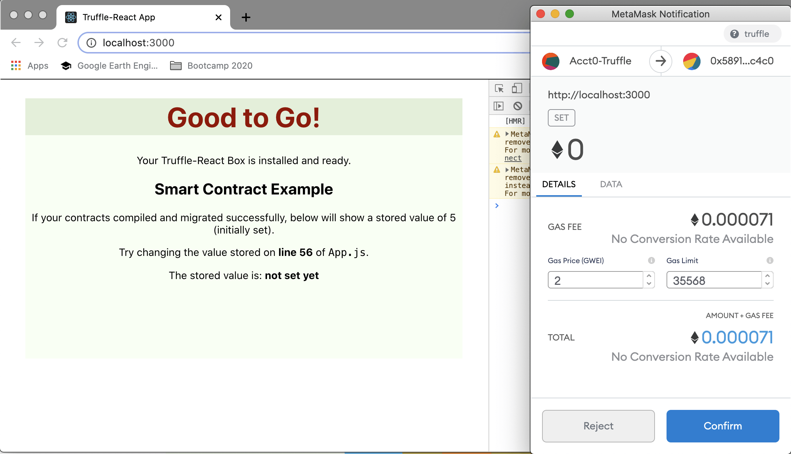

# Getting Started with Truffle and React
*(Written in May 2021)*
## Table of Contents
* [Introduction](#introduction)
* [Purpose of the demo](#purpose-of-the-demo)
* [What is not in the demo](#what-is-not-in-the-demo)
* [Install the demo](#install-the-demo)
* [Specific Setup](#specific-setup)
* [Run the demo](run-the-demo)
* [Most frequent errors](#most-frequent-errors)
* [Bonuses](#bonuses)
* [Learn more about a full development cycle](#learn-more-about-a-full-development-cycle)
* [Learn more about React](#learn-more-about-react)
* [License](#license)

## Introduction

This project is an update to the [Truffle Box "React"](https://www.trufflesuite.com/boxes/react). This Truffle Box illustrates a bare-bones React frontend interfacing to a smart contract. The initial goal of this project was to port the original frontend of ConsenSys into a version that uses React "hooks" instead of using classes, as more and more React frontends use this new paradigm, after React v16 has been issued.

In the process, the following changes were also added:
* add a `try/catch` to protect the error when the user forgets in MetaMask to use the local `develop` network generated by Truffle
* add the information to use `node v12.18.4` instead of the latest `v14`, with which `truffle 15.1` is incompatible and can't deploy its `develop` network
* modify `App.css` for another theme of colors than the original all-white theme.
* add more explanations to the original terse page, explaining most common mistakes specially for beginners.
* add a [description of a full cycle of development](devtutorial/devTuto-1.md) starting from scratch and using `truffle init` and `create-react-app`.

_**Note**: In branch `userInput` there's a version where the value to be set in the smart contract is given by the user. <br>Version in test_

## Purpose of the demo

The Truffle Box React illustrates a large part of the  Truffle+React development lifecycle. Its purpose is to familiarize the reader with the dApp development cycle, using Truffle and React.
* Truffle is used to deploy a local test blockchain, to compile and deploy smart contracts on this blockchain and to run automated tests.
* React is used to support JavaScript frontend development, with compile and execution for immediate visual feedback.

The setup process described below go through 3 stages. The first 2 are described here mainly for the sake of completude but can usually be skipped if already done in another context.
1. **general purpose setup**: this can be skipped if the reader already installed it for other needs;
2. **development setup**: this setup is specific to blockchain+React development, and may also exist already;
3. **specific setup and run**: this part is specific to the demo.


## What is not in the demo
The deployment in production is not included in this demo:
* Truffle can be used to deploy in production on a public testnet or the mainnet
* The standalone frontend code `build` made by React can be deployed in a public hosting service.
  
This deployment stage of the lifecycle is illustrated in another demo, available at https://github.com/kvutien/ipfs-dapp.git

## Install the demo
We'll use the command line console. The following installation instructions are for Linux or MacOS, that are Unix-based. 

If you run Windows, it is strongly recommended to install [VirtualBox](https://www.virtualbox.org/wiki/Downloads) and, inside it, install an Ubuntu virtual machine. See instruction guide for both installations in this 4-minute long [YouTube clip:](https://youtu.be/8mns5yqMfZk). 

## General purpose setup

_Feel free to skip [this section](./README-1.md) if you have already this environment._

## Development setup

_Feel free to skip [this section](./README-2.md) if you have already this development environment._

## Specific Setup

* Clone this repository
``` shell
$ git clone https://github.com/kvutien/truffle-react-hooks.git 
    Cloning into 'truffle-react-hooks'...
    remote: Enumerating objects: 34710, done.
    remote: Counting objects: 100% (34710/34710), done.
    remote: Compressing objects: 100% (26197/26197), done.
    remote: Total 34710 (delta 6840), reused 34710 (delta 6840), pack-reused 0
    Receiving objects: 100% (34710/34710), 40.60 MiB | 24.70 MiB/s, done.
    Resolving deltas: 100% (6840/6840), done.
$ cd truffle-react-hooks/client
```
* install the dependencies
``` shell
$ npm install
    ...
    found 80 vulnerabilities (1 low, 79 moderate)
    run `npm audit fix` to fix them, or `npm audit` for details
$
```
Disregard the warnings. 

## Run the demo
We assume that you have the local blockchain `truffle develop` running. Else see in the [development setup](./README-2.md#install-truffle).
* Compile and deploy the smart contract on the `truffle develop` local network.
``` shell
$ truffle develop
    ...
truffle(develop)> migrate
    Compiling your contracts...
    ===========================
    > Compiling ./contracts/Migrations.sol
    > Compiling ./contracts/SimpleStorage.sol
    > Artifacts written to /Users/kvutien/development/truffle-react-hooks/client/src/contracts
    > Compiled successfully using:
    - solc: 0.5.16+commit.9c3226ce.Emscripten.clang

    Starting migrations...
    ======================
    > Network name:    'develop'
    > Network id:      5777
    > Block gas limit: 6721975 (0x6691b7)

    1_initial_migration.js
    ======================
    Replacing 'Migrations'
    ----------------------
    > transaction hash:    0xddd621de3c74dbe90b93be4d73733f764ad6607d24b6256efbc813149cd76923
    > Blocks: 0            Seconds: 0
    > contract address:    0x597328E0Ca20b7A7FEfc399e5E36Ab4Da4A5E43A
    > block number:        1
    > block timestamp:     1621794897
    > account:             0x4d79c0d414E7E70B6323904d3A9085B86d8f82Ff
    > balance:             99.99616114
    > gas used:            191943 (0x2edc7)
    > gas price:           20 gwei
    > value sent:          0 ETH
    > total cost:          0.00383886 ETH

    > Saving migration to chain.
    > Saving artifacts
    -------------------------------------
    > Total cost:          0.00383886 ETH

    2_deploy_contracts.js
    =====================
    Replacing 'SimpleStorage'
    -------------------------
    > transaction hash:    0xff1aa320aae3a57233246a15442ad729fe202570e29bff06b72183752a5c30ff
    > Blocks: 0            Seconds: 0
    > contract address:    0x58919E4c76330DB629FC1D79bee533Fc6Aa1c4c0
    > block number:        3
    > block timestamp:     1621794897
    > account:             0x4d79c0d414E7E70B6323904d3A9085B86d8f82Ff
    > balance:             99.9933906
    > gas used:            96189 (0x177bd)
    > gas price:           20 gwei
    > value sent:          0 ETH
    > total cost:          0.00192378 ETH

    > Saving migration to chain.
    > Saving artifacts
    -------------------------------------
    > Total cost:          0.00192378 ETH

    Summary
    =======
    > Total deployments:   2
    > Final cost:          0.00576264 ETH
```

* make sure once more that Metamask is using the truffle local `develop` network. Else the transaction will be refused. If this is the case, select the network and refresh the screen to reload the dApp.
* if you have already used MetaMask on the local `develop` blockchain, reset the account imported from this network.
* in another console window, run the demo by typing
``` shell
$ cd client
$ npm start
```
* your browser will open a new tab and display



* once you confirm, the last line will show "The stored value is: 5". This proves that your frontend is discussing with the smart contract.
* now, edit `App.js` to change the value in the line as recommended. Save. 
* observe that the web page is refreshed, that MetaMask asks you once more to confirm a transaction, and that after you confirm the new value is displayed.

## Most frequent errors
### 1. `truffle develop` does nothing
When `truffle develop` doesn't display the 10 accounts generated as shown above, this means it could not deploy the local blockchain due to an incompatibility between `truffle 5.1` and the version of `nodeJS` that you're using. Use [nvm](https://tecadmin.net/how-to-install-nvm-on-ubuntu-20-04/) (node version manager) to downgrade to `node 12.18.4`
``` shell
$ nvm use 12.18.4
```
### 2. The last line still shows 'The stored value: not set yet' after MetaMask confirm
You probably redeployed again the `truffle develop` network, but not reset the account previously imported in Metamask, making the new accounts mismatch the nonce of the accounts imported previously in MetaMask. 

Click on the "account" icon of MetaMask (top right) and chose "Settings", "Advanced", "Reset account". Reload the web page.

### 3. `npm start` displays an error
React resides in the folder `client`. If you run `npm start` from the root folder containing the folders generated by truffle, you'll an error message:
```shell
npm start
npm ERR! code ENOENT
npm ERR! syscall open
npm ERR! path .../truffle-react-hooks/package.json
npm ERR! errno -2
npm ERR! enoent ENOENT: no such file or directory, open '/Users/kvutien/development/truffle-react-new/package.json'
npm ERR! enoent This is related to npm not being able to find a file.
npm ERR! enoent 

npm ERR! A complete log of this run can be found in:
npm ERR!     ~/.npm/_logs/2021-05-23T21_05_54_521Z-debug.log
```
To succeed running `npm start` you have to be in the folder `client`.
## Bonuses

_Feel free to skip [this section](./README-3.md) that contains bonuses that are useful but may exceed your first-step familiarization._

## Learn more about a full development cycle
You may want to check the [tutorial for a full development cycle](./devtutorial/devTuto-1.md).

## Learn More about React

You can learn more in the [Create React App documentation](https://facebook.github.io/create-react-app/docs/getting-started).

To learn React, check out the [React documentation](https://reactjs.org/).

### Code Splitting

This section has moved here: [https://facebook.github.io/create-react-app/docs/code-splitting](https://facebook.github.io/create-react-app/docs/code-splitting)

### Analyzing the Bundle Size

This section has moved here: [https://facebook.github.io/create-react-app/docs/analyzing-the-bundle-size](https://facebook.github.io/create-react-app/docs/analyzing-the-bundle-size)

### Making a Progressive Web App

This section has moved here: [https://facebook.github.io/create-react-app/docs/making-a-progressive-web-app](https://facebook.github.io/create-react-app/docs/making-a-progressive-web-app)

### Advanced Configuration

This section has moved here: [https://facebook.github.io/create-react-app/docs/advanced-configuration](https://facebook.github.io/create-react-app/docs/advanced-configuration)

### Deployment

This section has moved here: [https://facebook.github.io/create-react-app/docs/deployment](https://facebook.github.io/create-react-app/docs/deployment)

### `yarn build` fails to minify

This section has moved here: [https://facebook.github.io/create-react-app/docs/troubleshooting#npm-run-build-fails-to-minify](https://facebook.github.io/create-react-app/docs/troubleshooting#npm-run-build-fails-to-minify)

## License
MIT (c)2021-Vu Tien Khang

## Badge
[](https://github.com/RichardLitt/standard-readme)
