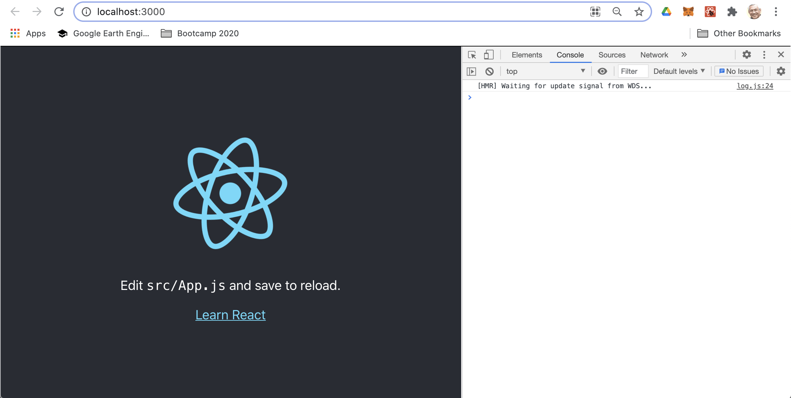

# Install dev environment and start from scratch (Part 1: scaffolding)
*(Written in May 2021)*

In the README of this repository, we have seen how to clone, install and run an existing dApp. Now, as said the Chinese proverb "_Give man a bowl of rice, you feed him for one meal. Teach a man how to grow rice, you feed him for his lifetime_".

Let's take advantage of the simplicity of this dApp to see how to develop starting from scratch and reach the same result. This process can be generalized to all your future developments.

* This Part 1 presents the scaffolding of the dApp and the dependencies,
* In [Part 2](./devTuto-2.md) we code the Solidity backend,
* In [Part 3](./devTuto-3.md) we code the JavaScript React frontend,
* In [Part 4](./devTuto-4.md) we publish our work on Github.

## Environment Set up
**Important note:**
The latest Truffle installed from npm is `truffle v5.1.46 (core: 5.1.46)`. The latest LTS (Long Term Support) of nodeJS is `node v14.17.0`. In this configuration, `truffle compile` works but `truffle develop` doesn't deploy any local blockchain. We need to downgrade to `node 12.18.4` for `truffle develop` to deploy correctly a local blockchain.

The development environment setup was described [here](../README-2.md).

## Scaffold with truffle init and create-react-app
We assume that truffle is installed globally. If not, refer to [Install truffle](../README-2.md#install-truffle).

### Create a folder and initiate a truffle project
```shell
$ mkdir truffle-react-new
$ cd truffle-react-new
truffle-react-new $ truffle init
    Starting init...
    ================
    > Copying project files to /Users/kvutien/development/truffle-react-new
    Init successful, sweet!
    kvutien@VTKT5 truffle-react-new % tree
    .
    ├── contracts
    │   └── Migrations.sol
    ├── migrations
    │   └── 1_initial_migration.js
    ├── test
    └── truffle-config.js

    3 directories, 3 files
```
We notice that at this stage we have no dependencies `package.json`, and no folder `node_modules` because this minimal truffle project has no frontend, no JavaScript.

### Set up a git repository
It is good development practice to make it a git repository and commit this initialized truffle project as a checkpoint.
```shell
truffle-react-new $ git init
    Initialized empty Git repository in /Users/kvutien/development/truffle-react-new/.git/
    kvutien@VTKT5 truffle-react-new % git add .
    kvutien@VTKT5 truffle-react-new % git commit -m "boilerplate truffle"
    [master (root-commit) f7120db] boilerplate truffle
    Committer: kvutien <kvutien@VTKT5.fritz.box>
    Your name and email address were configured automatically based
    on your username and hostname. Please check that they are accurate.
    You can suppress this message by setting them explicitly:
    ...
    4 files changed, 120 insertions(+)
    create mode 100644 contracts/Migrations.sol
    create mode 100644 migrations/1_initial_migration.js
    create mode 100644 test/.gitkeep
    create mode 100644 truffle-config.js
```
Make a `.gitignore` file to avoid loading the repository with working files. This `.gitignore` anticipates and names some files we'll see only later in this development.
```git
# See https://help.github.com/articles/ignoring-files/ for more about ignoring files.

# dependencies
/client/node_modules/
/.pnp
.pnp.js

# testing
/coverage

# production
/build

# misc
.DS_Store
.env.local
.env.development.local
.env.test.local
.env.production.local
/.vscode

npm-debug.log*
yarn-debug.log*
yarn-error.log*
```
### Create the frontend scaffold
For readability, we want to separate the components of the React frontend from those generated by truffle. For this, we locate the React components inside the folder `client`. To scaffold a boilerplate React app inside the folder `client` we invoke the latest version of `create-react-app`. Once done it self-uninstalls.
```shell
truffle-react-new $ npx create-react-app client
    Creating a new React app in /Users/kvutien/development/truffle-react-new/client.
    Installing packages. This might take a couple of minutes.
    Installing react, react-dom, and react-scripts with cra-template...
    ...
    Success! Created client at /Users/kvutien/development/truffle-react-new/client
    ...
    Happy hacking!
```
The new content of the project contains the populated folder `client`, including a `package.json` that is used to reproduce always the same folder `node_modules` with the packages that the frontend needs.
```shell
truffle-react-new $ tree
    .
    ├── client
    │   ├── README.md
    │   ├── package.json
    │   ├── node_modules
    ... (1050 items)
    │   ├── public
    │   │   ├── favicon.ico
    │   │   ├── index.html
    │   │   ├── logo192.png
    │   │   ├── logo512.png
    │   │   ├── manifest.json
    │   │   └── robots.txt
    │   ├── src
    │   │   ├── App.css
    │   │   ├── App.js
    │   │   ├── App.test.js
    │   │   ├── index.css
    │   │   ├── index.js
    │   │   ├── logo.svg
    │   │   ├── reportWebVitals.js
    │   │   └── setupTests.js
    │   └── yarn.lock
    ├── contracts
    │   └── Migrations.sol
    ├── migrations
    │   └── 1_initial_migration.js
    ├── test
    └── truffle-config.js
```
We move inside `client` and test run the minimum React app.
```
browser-create-react-app $ cd /Users/kvutien/development/truffle-react-new/client 
client $ npm start
```
The minimum React app is displayed by the local server at port 3000. The console message "[HMR] Waiting for update signal from WDS..." means that the Hot Module Reload (HMR) is waiting to reload the page every time you save a change in the code, which triggers a signal from the Webpack Display Server (WDS).



## Add dependency web3
The package `web3` is needed to do blockchain transactions from the frontend. It is not provided with Truffle, so we have to install it manually. The dependencies in `package.json` will be updated automatically.
```shell
truffle-react-new $ cd client
client $ npm install web3
    ...
    + web3@1.3.6
    added 511 packages from 326 contributors, removed 217 packages, updated 1476 packages and audited 1994 packages in 133.768s

    found 80 vulnerabilities (1 low, 79 moderate)
    run `npm audit fix` to fix them, or `npm audit` for details
```

## Caveat: Required folder structures
Keep note of the following caveats in the required folder structure created by the scaffolding tools `truffle init` and `create-react-app`.
* To launch the frontend we need to launch the command from the folder that contains `package.json` because this file contains the React script `start`.
* The file `package.json` needs to be in the same folder that contains the folder `node_modules`.
* Truffle stores the compilation artefacts, that contain the ABI (Application Binary Interface) of the smart contracts, by default in the folder `build` of the root folder of the project. But the React frontend cannot reach outside the root folder of the React project (here it is the folder `client`). To solve this, we specify in `truffle-config.js` the path where truffle should store the artefacts: 
```javascript
const path = require("path");
...
contracts_build_directory: path.join(__dirname, "client/src/contracts"),
```
Now we can start making the code. We start with [the Solidity backend](./devTuto-2.md), that is in the folder `contracts`, and the frontend that is in the folder `client/src`.
