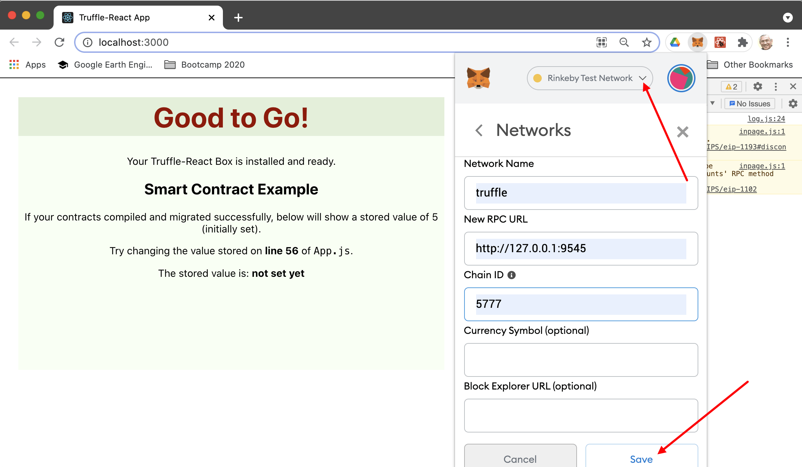
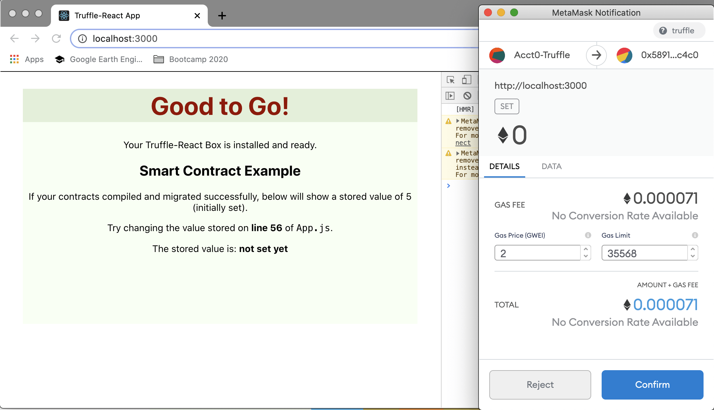

# Install dev environment and start from scratch (Part 3: Frontend React code)
In the README of this repository, we have seen how to clone, install and run an existing dApp. Now, as said the Chinese proverb "_Give a man a bowl of rice, you feed him for one meal. Teach a man how to grow rice, you feed him for his lifetime_".

Let's take advantage of the simplicity of this dApp to see how to develop starting from scratch and reach the same result. This process can be generalized to all your future developments.

* In [Part 1](./devTuto-1.md) we presented the scaffolding of the dApp and the dependencies,
* In [Part 2](./devTuto-2.md) we coded the Solidity backend,
* In this Part 3 we code the JavaScript React frontend,
* In [Part 4](./devTuto-4.md) we publish our work on Github.


## Quick presentation of a React application
We repeat here part of a tutorial in a Full Stack demo dApp using IPFS, in https://github.com/kvutien/ipfs-dapp.git

React is a tool that reads a mixture of JavaScript and XML code ("JSX") to generate HTML code using a "transpiler" named Babel. React injects this HTML inside a `div` component of the main index.html that is rendered by a browser. This component `div` is always called "root".

A React user application resides mainly inside a component named `App.js` and in its related `App.css` style sheet. To build a standalone application that a web host can serve starting from index.html, React uses the open source webpack tool that bundles all JavaScript modules. Besides that, React imposes no special coding style nor paradigm.

We can summarize a typical React web app as follows:


## Adapt the main program `App.js`
The `App.js` code uses some idiosyncrasies of React constructs:
* The 'state variables' are JavaScript variables that are available everywhere in the program. They serve specially for the HTML to have access to the computed results. They are always initiated at the beginning with the function `useState`. This function returns a callback `setVariableName()` that we use in the code to update the value of the variable `VariableName`.
* The `useEffect()` hook is called by React whenever the monitored state variable is modified. Its syntax is `useEffect(callback, [monitoredVars])`.

The `App.js` code of our frontend is
```javascript
/*
 * Main entry point of a React application
 * version of Truffle "React" box adapted to use "hooks" instead of classes,
 * starting from React v16
 */
import React, { useState, useEffect } from "react";
import SimpleStorageContract from "./contracts/SimpleStorage.json";
import getWeb3 from "./getWeb3";

import "./App.css";

function App() {
    // initialize the state variables of the application
    const [storageValue, setStorageValue] = useState(undefined);
    const [web3, setWeb3] = useState(undefined);
    const [accounts, setAccounts] = useState(undefined);
    const [contract, setContract] = useState(undefined);

    // equivalent to the componentDidMount function of older React frameworks
    useEffect( () => {
        const init = async () => {
            try {
                // Get network provider (typically MetaMask) and web3 instance
                const web3 = await getWeb3();

                // Use web3 to get the user's accounts from the provider (MetaMask)
                const accounts = await web3.eth.getAccounts();

                // Get the contract instance
                const networkId = await web3.eth.net.getId();
                const deployedNetwork = SimpleStorageContract.networks[networkId];
                const instance = new web3.eth.Contract(
                    SimpleStorageContract.abi,
                    deployedNetwork && deployedNetwork.address,
                );
                // Set web3, accounts, contract to the state
                setWeb3(web3);
                setContract(instance);
                setAccounts(accounts);
            } catch (error) {
                // Catch any errors for any of the above operations
                alert(
                    `Failed to load web3, accounts, or contract. Did you migrate the contract or install MetaMask? Check console for details.`,
                );
                console.error(error);
            }
        };
        init();
    }, []);

    // is called whenever there was any change in the state variables web3, accounts, contract
    useEffect( () => {
        const runExample = async () => {
            // example of interaction with the smart contract
            try{
                // Stores a given value, 5 by default
                await contract.methods.set(5).send({ from: accounts[0] });

                // Get the value from the contract to prove it worked
                const response = await contract.methods.get().call();

                // Update state with the result
                setStorageValue (response);
            }
            catch{
                alert('No contract deployed or account error; please check that MetaMask is on the correct network, reset the account and reload page');
            }
        }
        if(typeof(web3) != 'undefined'
            && typeof(accounts) != 'undefined'
            && typeof(contract) != 'undefined'){
            runExample();
        }
    }, [web3, accounts, contract]);

    if (typeof(web3) === 'undefined') {
        return <div>Loading Web3, accounts, and contract...</div>;
    }

    // equivalent to the render function of older React frameworks
    return (
        <div className="App">
        <h1 className="App-header">Good to Go!</h1>
        <p>Your Truffle-React Box is installed and ready.</p>
        <h2>Smart Contract Example</h2>
        <p>
            If your contracts compiled and migrated successfully, below will show
            a stored value of 5 (initially set).
        </p>
        <p>
            Try changing the value stored on <strong>line 56</strong> of <code>App.js</code>.
        </p>
        <div>The stored value is: <strong>{(storageValue)? storageValue: 'not set yet'}</strong></div>
        </div>
    );
}

export default App;
```

## Change `App.css`
The look & feel of `App.js` depends on this file. The code generated by `create-react-app` is changed to
```css
.App {
  text-align: center;
}

.App-logo {
  height: 40vmin;
}

.App-header {
  background-color: #282c34;
  min-height: 100vh;
  display: flex;
  flex-direction: column;
  align-items: center;
  justify-content: center;
  font-size: calc(10px + 2vmin);
  color: white;
}

.App-link {
  color: #09d3ac;
}
```

## Add `getWeb3.js`
This function returns a `web3` object that contains the API to make blockchain transactions. 

The code is
```javascript
import Web3 from "web3";

const getWeb3 = () =>
  new Promise((resolve, reject) => {
    // Wait for loading completion to avoid race conditions with web3 injection timing.
    window.addEventListener("load", async () => {
      // Modern dapp browsers...
      if (window.ethereum) {
        const web3 = new Web3(window.ethereum);
        try {
          // Request account access if needed
          await window.ethereum.enable();
          // Acccounts now exposed
          resolve(web3);
        } catch (error) {
          reject(error);
        }
      }
      // Legacy dapp browsers...
      else if (window.web3) {
        // Use Mist/MetaMask's provider.
        const web3 = window.web3;
        console.log("Injected web3 detected.");
        resolve(web3);
      }
      // Fallback to localhost; use dev console port by default...
      else {
        const provider = new Web3.providers.HttpProvider(
          "http://127.0.0.1:8545"
        );
        const web3 = new Web3(provider);
        console.log("No web3 instance injected, using Local web3.");
        resolve(web3);
      }
    });
  });

export default getWeb3;
```
## Run
Check that MetaMask is connected to the local blockchain generated by Truffle,the URL and port are http://127.0.0.1:9545.


Move to the `client` folder and type `npm start`. Our React frontend should display the same as when we simply installed from the clone.


Our dApp is coded and runs. As a true developer, we now [publish our git on our Github](./devTuto-4.md).
