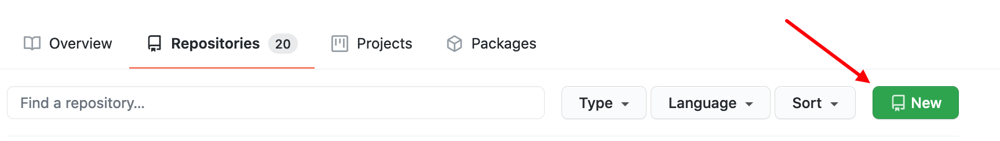
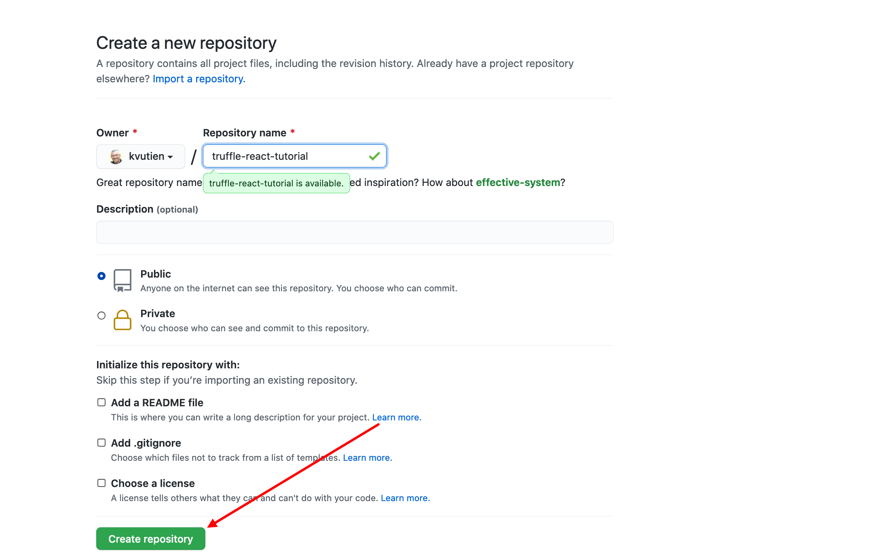

# Install dev environment and start from scratch (Part 4: publish on Github)
In the README of this repository, we have seen how to clone, install and run an existing dApp. Now, as said the Chinese proverb "_Give a man a bowl of rice, you feed him for one meal. Teach a man how to grow rice, you feed him for his lifetime_".

Let's take advantage of the simplicity of this dApp to see how to develop starting from scratch and reach the same result. This process can be generalized to all your future developments.

* In [Part 1](./devTuto-1.md) we presented the scaffolding of the dApp and the dependencies,
* In [Part 2](./devTuto-2.md) we coded the Solidity frontend,
* In  [Part 3](./devTuto-3.md) we coded the JavaScript React backend
* In this Part 4 we publish our work on Github.

Publishing on Github not only makes your portfolio known publicly, it also prepares for production deployment of your dApp on most advanced public hosting services.

## Commit the git
In the terminal we check what is not yet tracked and committed.
```shell
truffle-react-new $ git status
    On branch master
    Changes not staged for commit:
    (use "git add <file>..." to update what will be committed)
    (use "git restore <file>..." to discard changes in working directory)
        modified:   .gitignore
        ...

    Untracked files:
    (use "git add <file>..." to include in what will be committed)
        README.md
        ...

    no changes added to commit (use "git add" and/or "git commit -a")
```
We stage all files that are not yet tracked
```shell
truffle-react-new $ git add -A
```
We commit
```shell
truffle-react-new $ git commit -m "add react frontend"
```

## Create Github repository
In Github web site, create a new repository `truffle-react-tutorial`.




and link it with our folder `truffle-react-tutorial`.
```shell
truffle-react-new $ git remote add origin https://github.com/kvutien/truffle-react-tutorial.git
truffle-react-new $ git branch -M main 
truffle-react-new $ git push -u origin main
    Enumerating objects: 5, done.
    Counting objects: 100% (5/5), done.
    Delta compression using up to 4 threads
    Compressing objects: 100% (3/3), done.
    Writing objects: 100% (3/3), 292 bytes | 292.00 KiB/s, done.
    Total 3 (delta 2), reused 0 (delta 0), pack-reused 0
    remote: Resolving deltas: 100% (2/2), completed with 2 local objects.
    To https://github.com/kvutien/truffle-react-tutorial.git
    30a63bea..89ac662a  main -> main
    Branch 'main' set up to track remote branch 'main' from 'origin'.
```

Congratulations. You've created a complete dApp from scratch and published it. You can now check the result by cloning this repository and make a `README.md`

The next step is to deploy it in production. This was described in another repository, a Full Stack demo with IPFS access: https://github.com/kvutien/ipfs-dapp.git
